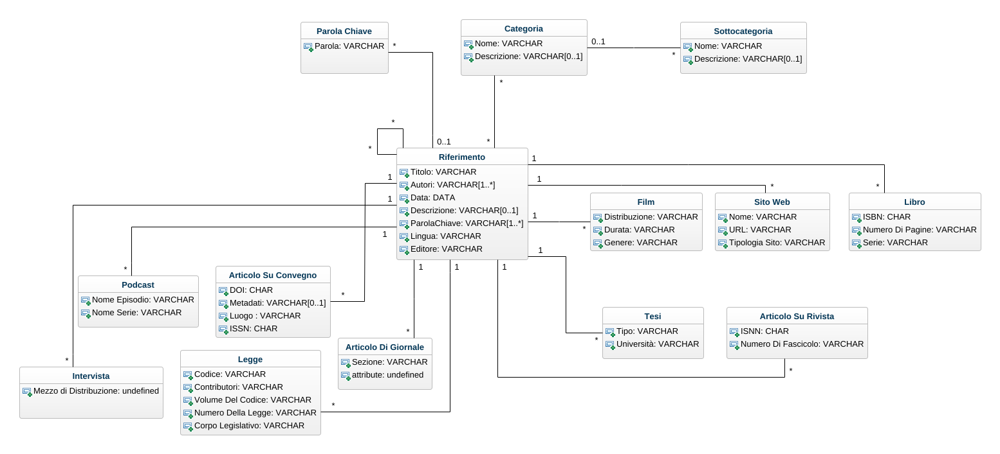
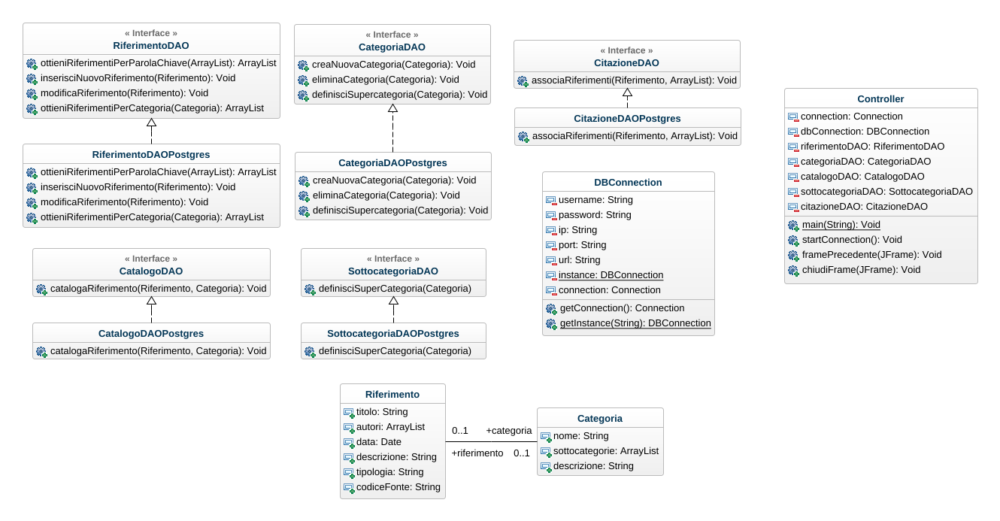

# Progetto Object Orientation A.A. 2021-2022
## Traccia
Si sviluppi un sistema informativo, composto da una base di dati relazionale e da un applicativo Java dotato di GUI (Swing o JavaFX), per la gestione di bibliografie. Il sistema permette agli utenti di salvare e organizzare i propri riferimenti bibliografici. In particolare, è possibile inserire/modificare/rimuovere riferimenti bibliografici di diverso tipo (e.g.: articoli scientifici su conferenza o rivista, libri, risorse on-line, dataset, etc.). Ciascun riferimento è caratterizzato da un titolo univoco, un elenco di autori, una data, un URL (obbligatorio solo per risorse on-line), un DOI (facoltativo, ma univoco ove presente), e una descrizione testuale in cui l’utente può indicare aspetti significativi. Inoltre, un riferimento può essere associato a un insieme di rimandi, ovvero di altri riferimenti presenti nel sistema che vengono menzionati nel testo. Un utente, infine, può definire un insieme di categorie personalizzate e possibilmente gerarchiche, e associare ciascun riferimento a una o più categorie. Per organizzazione gerarchica delle categorie si intende la possibilità di specificare che una certa categoria (e.g.: “Informatica”) ha una o più sotto-categorie (e.g.: “Basi di Dati” o “Testing”). Non è possibile introdurre dipendenze cicliche, ovvero non è possibile che una categoria sia una sotto-categoria (anche transitivamente) di sé stessa. L’appartenenza a una sotto-categoria implica l’appartenenza a tutte le sue super-categorie. Non è pertanto possibile associare esplicitamente a un riferimento una categoria e una sua super-categoria. Il sistema permette infine di effettuare interrogazioni avanzate, con possibilità di filtraggio per una o più categorie, per data, per parole chiave e per autore. Inoltre, è possibile ordinare i riferimenti per numero di citazioni ricevute, ovvero per il numero di volte in cui il riferimento è presente nei rimandi di altri riferimenti.

## Progettazione del database
Di seguito verrà descritta la fase progettuale del database.
### Class Diagram


Facendo riferimento alla traccia ho stilato il presente diagramma delle classi. Ho individuato 2 entità fondamentali:
1. Riferimento: il rimando ad una data fonte che può essere:
	1. Un libro.
	2. Un sito web.
	3. Un atto di convegno.
	4. Un articolo di rivista.
	5. Un'intervista.
	6. Una tesi.
	7. Un articolo di giornale.
	8. Una legge.
	9. Un podcast.
	10. Un film.
2. Categoria: una suddivisione di riferimenti che può essere definita dall'utente.
### Ristrutturazione



Per la ristrutturazione del diagramma ho dovuto:

1. Rimuovere le specializzazioni; ho preferito rendere le specializzazioni, delle classi indipendenti per evitare di includere troppi attributi nella singola classe `Riferimento`; ciò comporterebbe un gran spreco di memoria poiché non tutti gli attributi stanziati verrebbero assegnati (discriminante), avendo molti record con valori `NULL`.
2. Gli attributi `Parola Chiave` e `Sottocategoria` sono anch'essi divenuti due classi per necessità di implementazione.

### Schema delle relazioni

$$
\text{Citazione(}\underline{\text{ID}},\underline{\underline{\text{Menzionato}}},\underline{\underline{\text{Riferimento}}}\text{)}\\
\text{Riferimento(}\underline{\text{Titolo}}\text{, Autori, Data, Descrizione, ISBN, DOI, URL, ISNN)}\\
\text{Categoria(}\underline{\text{Nome}},\text{Descrizione)}\\
\text{Sottocategoria(}\underline{\text{Nome}}\text{, Descrizione},\underline{\underline{\text{Supercategoria}}})\\
\text{Bibliografia(}\underline{\underline{\text{Riferimento}}},\underline{\underline{\text{Categoria}}})
$$

### Script SQL per la definizione del DB

```sql

-- La tabella `riferimento` tiene traccia dei riferimenti. Ogni riferimento può essere: di un libro (ISBN), di una risorsa online (URL), di un dataset (DOI) o di un articolo scientifico (ISSN).

create type tipologia as enum (
    'libro',
    'art_rivista',
    'art_convegno',
    'art_giornale',
    'tesi',
    'web',
    'film',
    'intervista',
    'legge',
    'podcast'
)

create table riferimento (
    riferimento_id serial primary key,
    titolo varchar(200) unique,
    autori varchar(500),
    data_pub varchar(15),
    descrizione varchar(1000),
    lingua varchar(200),
    tipo tipologia
)

create table libro (
	isbn char(14) primary key check (isbn ~* '^[0-9]{3}-[0-9]{10}$'),
    pagine varchar(50),
    serie varchar(200),
    volume varchar(200),
    riferimento_id int,
    constraint riferimento_libro foreign key (riferimento_id) references Riferimento(riferimento_id) on delete cascade
)

create table rivista (
	issn char(9) primary key check (issn ~*'^ISSN [0-9]{4}-[0-9]{4}$'),
    pagine varchar(50),
    fascicolo varchar(50),
    riferimento_id int,
    constraint riferimento_rivista foreign key (riferimento_id) references Riferimento(riferimento_id) on delete cascade
)

create table convegno (
	doi varchar(20) primary key,
    luogo varchar(200),
	riferimento_id int,
    constraint riferimento_convegno foreign key (riferimento_id) references Riferimento(riferimento_id) on delete cascade
)

create table giornale (
	issn char(9) primary key check (issn ~*'^ISSN [0-9]{4}-[0-9]{4}$'),
    testata varchar(50),
    sezione varchar(200),
    riferimento_id int,
    constraint riferimento_giornale foreign key (riferimento_id) references Riferimento(riferimento_id) on delete cascade
)

create table tesi (
	doi varchar(20) primary key,
    tipo_tesi varchar(200),
    ateneo varchar(200),
    riferimento_id int,
    constraint riferimento_tesi foreign key (riferimento_id) references Riferimento(riferimento_id) on delete cascade
)

create table web (
	url varchar(200) primary key, 
    sito varchar(200),
    tipo_sito varchar(200),
    riferimento_id int,
    constraint riferimento_web foreign key (riferimento_id) references Riferimento(riferimento_id) on delete cascade
)

create table film (
	isan char(32) primary key,
    genere varchar(200),
    distribuzione varchar(200),
    riferimento_id int,
    constraint riferimento_film foreign key (riferimento_id) references Riferimento(riferimento_id) on delete cascade
)

create table intervista (
	doi varchar(20) primary key,
    mezzo varchar(200),
    ospiti varchar(500),
    riferimento_id int,
    constraint riferimento_intervista foreign key (riferimento_id) references Riferimento(riferimento_id) on delete cascade
)

create table legge (
	numero varchar(25) primary key,
    tipo_legge varchar(30),
    codice varchar(200),
    riferimento_id int,
    constraint riferimento_legge foreign key (riferimento_id) references Riferimento(riferimento_id) on delete cascade
)

create table podcast (
	doi varchar(20) primary key,
    episodio varchar(200),
    serie varchar(200),
    riferimento_id int,
    constraint riferimento_podcast foreign key (riferimento_id) references Riferimento(riferimento_id) on delete cascade
)

-- La tabella `citazione` codifica la relazione * a * riflessiva. L'attributo `citazione.riferimento` indica il riferimento citante mentre `citazione.menzionato` indica il riferimento citato. 

create table citazione (
    id_citazione serial primary key,
    menzionato_id int,
    riferimento_id int,
    constraint citato foreign key (menzionato_id) references Riferimento(riferimento_id) on delete cascade,
    constraint citante foreign key (riferimento_id) references Riferimento(riferimento_id) on delete cascade
)

create table tag (
	id_tag serial primary key,
    parola varchar(15) unique,
    riferimento_id int,
    constraint riferimento_tags foreign key (riferimento_id) references Riferimento(riferimento_id) on delete set null
)

-- La tabella `categoria` contiene tutte le categorie create dall'utente

create table categoria (
    categoria_id serial primary key,
    nome varchar(100) unique,
    supercategoria_id int,
    constraint antenato foreign key (supercategoria_id) references Categoria(categoria_id) on delete cascade
)

-- La tabella `catalogo` codifica la relazione * a * tra `riferimento` e `categoria`. Consente di risalire alla categoria di ciascun riferimento, oppure di verificare quali riferimenti appartengono ad una data categoria.

create table catalogo (
    catalogo_id serial primary key,
    riferimento_id int,
    categoria_id int unique,
    -- Vincoli interrelazionali
    constraint riferimento foreign key (riferimento_id) references Riferimento(riferimento_id) on delete cascade,
    constraint categoria foreign key (categoria_id) references Categoria(categoria_id) on delete cascade
)

```

## Progettazione Software Java

### Class Diagram


