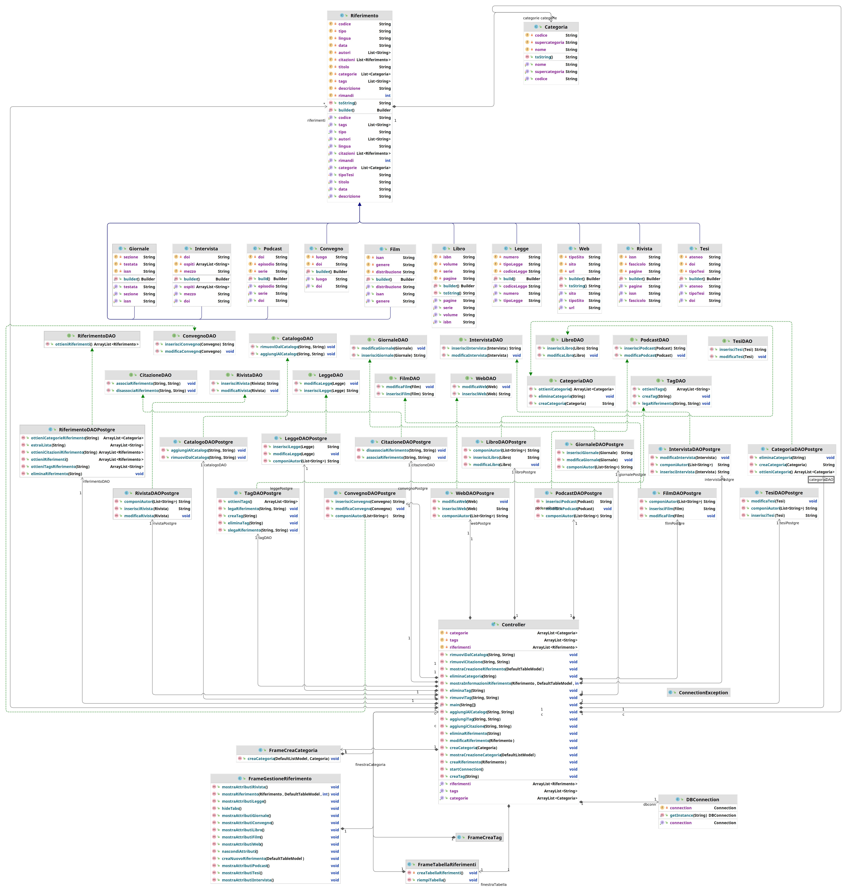

[](https://github.com/spicyhotnoodles/Object-Orientation-Project/blob/main/README.md)
[](https://github.com/spicyhotnoodles/Object-Orientation-Project/blob/main/README-it.md)

# Object Orientation Project
This is a repository to host a project I made for the Object Orientation exam at my university (Università di Napoli Federico II) 
## Essay
Develop an information system, consisting of a relational database and a Java application with a GUI (Swing or JavaFX), for managing bibliographies. The system allows users to save and organize their bibliographic references. In particular, it is possible to insert/modify/remove bibliographic references of different types (e.g.: scientific articles in conference or journal, books, online resources, datasets, etc.). Each reference is characterized by a unique title, a list of authors, a date, a URL (mandatory only for online resources), an optional DOI, and a textual description in which the user can indicate significant aspects. In addition, a reference can be associated with a set of citations, i.e., other references in the system that are mentioned in the text. Finally, a user can define a set of custom categories, possibly hierarchical, and associate each reference with one or more categories. By hierarchical organization of categories, it is meant the possibility of specifying that a certain category (e.g.: "Computer Science") has one or more subcategories (e.g.: "Databases" or "Testing"). It is not possible to introduce cyclic dependencies, i.e., it is not possible for a category to be a subcategory (even transitively) of itself. Belonging to a subcategory implies belonging to all its supercategories. It is therefore not possible to explicitly associate a reference with a category and its supercategory. The system finally allows advanced queries, with the possibility of filtering by one or more categories, by date, by keywords and by author. In addition, it is possible to sort the references by the number of citations received, i.e., by the number of times the reference is present in the citations of other references.

## Database Design
Below will be described the design phase of the database.
### Class Diagram


Referring to the prompt, I have drawn up the following class diagram. I have identified 2 fundamental entities:
1. Reference: the citation of a given source that can be:
   - A book.
   - A website.
   - A conference proceeding.
   - A journal article.
   - An interview.
   - A thesis.
   - A newspaper article.
   - A law.
   - A podcast.
   - A film.
2. Category: a subdivision of references that can be defined by the user.

### Refactoring


To refactor the diagram, and then be close to the implementation (I used Postgre) I had to:

1. Remove specializations; I preferred to make specializations independent classes to avoid including too many attributes in the single class 'Reference'; this would result in a lot of memory waste since not all allocated attributes would be assigned (discriminant), having many records with 'NULL' values.
2. The attributes 'Keyword' and 'Subcategory' have also become two classes out of implementation necessity.

### SQL Scripts to generate DB structure

```sql

-- `riferimento` table keeps track of the references. Each reference can be for a book (ISBN), an online resource (URL), a dataset (DOI), or a scientific article (ISSN).

create type tipologia as enum (
    'libro',
    'art_rivista',
    'art_convegno',
    'art_giornale',
    'tesi',
    'web',
    'film',
    'intervista',
    'legge',
    'podcast'
)

create table riferimento (
    riferimento_id serial primary key,
    titolo varchar(200) unique,
    autori varchar(500),
    data_pub varchar(15),
    descrizione varchar(1000),
    lingua varchar(200),
    tipo tipologia
)

create table libro (
	isbn char(14) primary key check (isbn ~* '^[0-9]{3}-[0-9]{10}$'),
    pagine varchar(50),
    serie varchar(200),
    volume varchar(200),
    riferimento_id int,
    constraint riferimento_libro foreign key (riferimento_id) references Riferimento(riferimento_id) on delete cascade
)

create table rivista (
	issn char(9) primary key check (issn ~*'^ISSN [0-9]{4}-[0-9]{4}$'),
    pagine varchar(50),
    fascicolo varchar(50),
    riferimento_id int,
    constraint riferimento_rivista foreign key (riferimento_id) references Riferimento(riferimento_id) on delete cascade
)

create table convegno (
	doi varchar(20) primary key,
    luogo varchar(200),
	riferimento_id int,
    constraint riferimento_convegno foreign key (riferimento_id) references Riferimento(riferimento_id) on delete cascade
)

create table giornale (
	issn char(9) primary key check (issn ~*'^ISSN [0-9]{4}-[0-9]{4}$'),
    testata varchar(50),
    sezione varchar(200),
    riferimento_id int,
    constraint riferimento_giornale foreign key (riferimento_id) references Riferimento(riferimento_id) on delete cascade
)

create table tesi (
	doi varchar(20) primary key,
    tipo_tesi varchar(200),
    ateneo varchar(200),
    riferimento_id int,
    constraint riferimento_tesi foreign key (riferimento_id) references Riferimento(riferimento_id) on delete cascade
)

create table web (
	url varchar(200) primary key, 
    sito varchar(200),
    tipo_sito varchar(200),
    riferimento_id int,
    constraint riferimento_web foreign key (riferimento_id) references Riferimento(riferimento_id) on delete cascade
)

create table film (
	isan char(32) primary key,
    genere varchar(200),
    distribuzione varchar(200),
    riferimento_id int,
    constraint riferimento_film foreign key (riferimento_id) references Riferimento(riferimento_id) on delete cascade
)

create table intervista (
	doi varchar(20) primary key,
    mezzo varchar(200),
    ospiti varchar(500),
    riferimento_id int,
    constraint riferimento_intervista foreign key (riferimento_id) references Riferimento(riferimento_id) on delete cascade
)

create table legge (
	numero varchar(25) primary key,
    tipo_legge varchar(30),
    codice varchar(200),
    riferimento_id int,
    constraint riferimento_legge foreign key (riferimento_id) references Riferimento(riferimento_id) on delete cascade
)

create table podcast (
	doi varchar(20) primary key,
    episodio varchar(200),
    serie varchar(200),
    riferimento_id int,
    constraint riferimento_podcast foreign key (riferimento_id) references Riferimento(riferimento_id) on delete cascade
)

-- `citazione` table encodes the reflexive * to * relationship. The attribute `citation.reference` indicates the citing reference while `citation.mentioned` indicates the referenced citation. 

create table citazione (
    id_citazione serial primary key,
    menzionato_id int,
    riferimento_id int,
    constraint citato foreign key (menzionato_id) references Riferimento(riferimento_id) on delete cascade,
    constraint citante foreign key (riferimento_id) references Riferimento(riferimento_id) on delete cascade
)

create table tag (
	id_tag serial primary key,
    parola varchar(15) unique,
    riferimento_id int,
    constraint riferimento_tags foreign key (riferimento_id) references Riferimento(riferimento_id) on delete set null
)

-- `categoria` table contains all the categories created by the user.

create table categoria (
    categoria_id serial primary key,
    nome varchar(100) unique,
    supercategoria_id int,
    constraint antenato foreign key (supercategoria_id) references Categoria(categoria_id) on delete cascade
)

-- `catalogo` table encodes the * to * relationship between `reference` and `category`. It allows to retrieve the category of each reference or to check which references belong to a given category.

create table catalogo (
    catalogo_id serial primary key,
    riferimento_id int,
    categoria_id int, -- unique
    -- Vincoli interrelazionali
    constraint riferimento foreign key (riferimento_id) references Riferimento(riferimento_id) on delete cascade,
    constraint categoria foreign key (categoria_id) references Categoria(categoria_id) on delete cascade
)

```

## Java Design

### Class Diagram



### Prototype

</img> </img> </img> </img>
