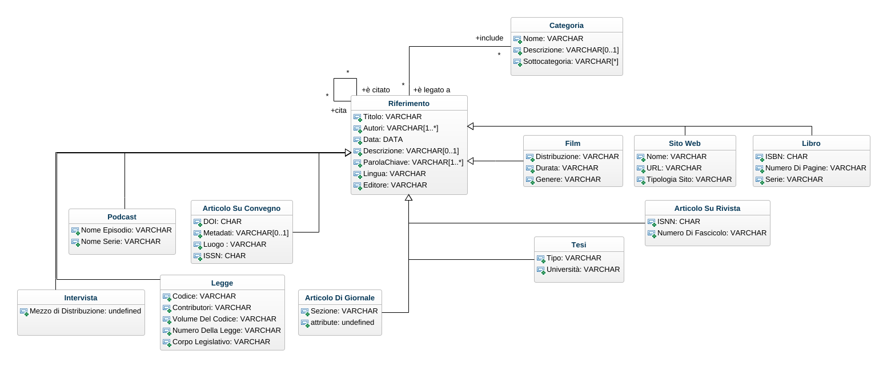
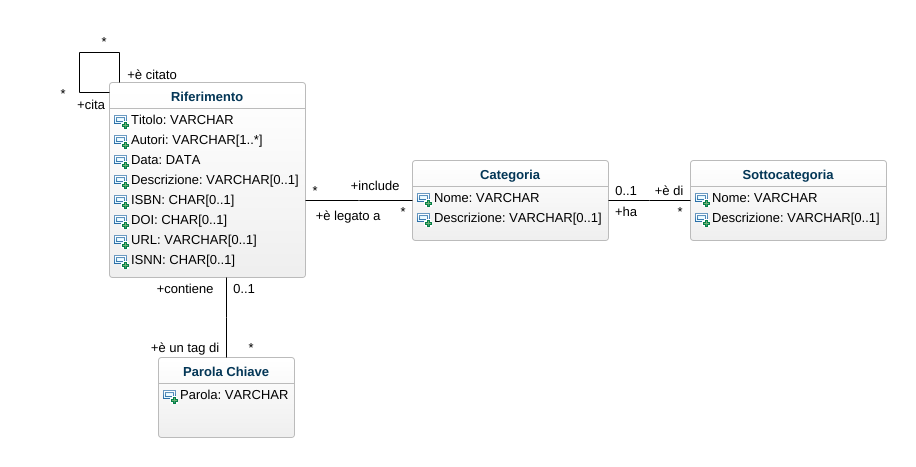

# Progetto Object Orientation A.A. 2021-2022
## Traccia
Si sviluppi un sistema informativo, composto da una base di dati relazionale e da un applicativo Java dotato di GUI (Swing o JavaFX), per la gestione di bibliografie.
Il sistema permette agli utenti di salvare e organizzare i propri riferimenti bibliografici. In particolare, è possibile inserire/modificare/rimuovere riferimenti bibliografici di diverso tipo (e.g.: articoli scientifici su conferenza o rivista, libri, risorse on-line, dataset, etc.).
Ciascun riferimento è caratterizzato da un titolo univoco, un elenco di autori, una data, un URL (obbligatorio solo per risorse on-line), un DOI (facoltativo, ma univoco ove presente), e una descrizione testuale in cui l’utente può indicare aspetti significativi. Inoltre, un riferimento può essere associato a un insieme di rimandi, ovvero di altri riferimenti presenti nel sistema che vengono menzionati nel testo.
Un utente, infine, può definire un insieme di categorie personalizzate e possibilmente gerarchiche, e associare ciascun riferimento a una o più categorie.
Per organizzazione gerarchica delle categorie si intende la possibilità di specificare che una certa categoria (e.g.: “Informatica”) ha una o più sotto-categorie (e.g.: “Basi di Dati” o “Testing”). Non è possibile introdurre dipendenze cicliche, ovvero non è possibile che una categoria sia una sotto-categoria (anche transitivamente) di sé stessa. L’appartenenza a una sotto-categoria implica l’appartenenza a tutte le sue super-categorie. Non è pertanto possibile associare esplicitamente a un riferimento una categoria e una sua super-categoria. Il sistema permette infine di effettuare interrogazioni avanzate, con possibilità di filtraggio per una o più categorie, per data, per parole chiave e per autore. Inoltre, è possibile ordinare i riferimenti per numero di citazioni ricevute, ovvero per il numero di volte in cui il riferimento è presente nei rimandi di altri riferimenti.

## Progettazione del database
Di seguito verrà descritta la fase progettuale del database.
### Class Diagram


Facendo riferimento alla traccia ho stilato il presente diagramma delle classi. Ho individuato 2 entità fondamentali:
1. Riferimento: il rimando ad una data fonte che può essere:
	1. Un libro.
	2. Una risorsa in rete: sito web, blog, social network, ecc.
	3. Un articolo scientifico su conferenza (ancora non ho idea di cosa sia) o su rivista.
	4. Un dataset (anche questo sconosciuto).
	5. Altri (?)
2. Categoria: una suddivisione di riferimenti che può essere definita dall'utente. Ha lo scopo di catalogare e accorpare riferimenti che trattano i medesimi argomenti (?).
### Ristrutturazione



Per la ristrutturazione del diagramma ho dovuto rimuovere le specializzazioni; ho preferito includere le classi specializzate nella generalizzazione, aggiungendo un attributo `Fonte: VARCHAR` per specificare quale/i riferimento/i viene/vengono citato/i dall'istanza corrente; ho definito un tipo `VARCHAR` poiché è possibile che l'istanza citi più di una fonte. La motivazione di questa scelta è dovuta alla grande quantità di associazioni che andrebbero codificate se fossero mantenute separate le varie specializzazioni. 

### Schema delle relazioni

### Script SQL per la definizione del DB

```sql
CREATE TABLE Riferimento (
	titolo: varchar(100) UNIQUE, primary key
    autori: varchar(250)
    pubblicazione: date
    isbn: char(13) UNIQUE
    doi: varchar UNIQUE
    descrizione: varchar(2000)
    url: varchar(300)
    fonte: varchar(2000)
    metadata: varchar(500)
    tag: varchar(1000)
)

CREATE TABLE Categoria (

)
```

